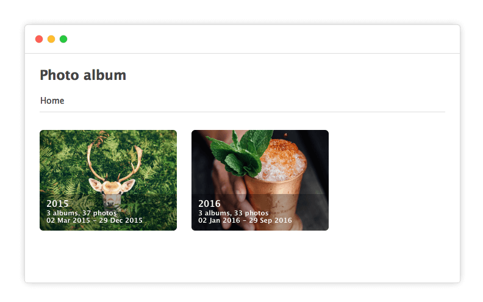
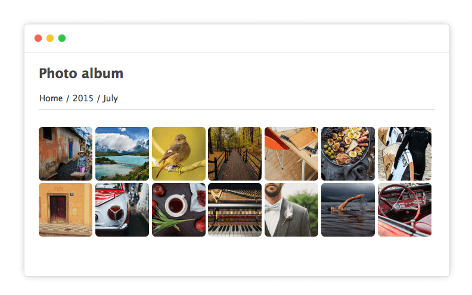

# Immich Static Gallery

A lightweight, Dockerized tool that syncs albums from your **[Immich](https://github.com/immich-app/immich)** server and generates a **static photo & video gallery** using **[Thumbsup](https://thumbsup.github.io/)**.

## Why?
Immich is amazing, but I don't feel confortable exposing my server with all my other services to the internet. This tool lets easily share and existing album publicly **without exposing your Immich server**.

---

## Features

- Syncs selected **Immich album(s)** via API
- Automatically **detects new photos/videos** using an internal cache
- Generates a static gallery using the **Thumbsup** engine (default theme: Cards)
- Runs in a **single Docker container**
- Configurable via `config.yaml`
- Docker compose file ready to use

---

## Demo




---

## Quick Start

### 1. Clone the repo

```bash
git clone https://github.com/carmolim/immich-static-gallery.git
cd immich-static-gallery

```

### 2. Create your `config.yaml`

Copy `config.yaml.example` to `config.yaml` and customize it.

```yaml
# Example config.yaml

albums:
  - id: "album-uuid-from-immich" # Get this from the Immich web UI URL
    slug: "family-vacation"      # URL-friendly name for the gallery folder
                                  # Use only letters, numbers, dots, underscores, and hyphens
    title: "Family Vacation"     # Display title for the gallery

scan:
  intervalMinutes: 60 # How often to check Immich for updates (in watch mode)

gallery:
  engine: "thumbsup" # Currently only thumbsup is supported
  flags:
    # Pass flags directly to the thumbsup command-line tool
    - "--theme"
    - "cards"
    - "--title"
    - "My Awesome Gallery"
    - "--sort-media-direction"
    - "desc"
    - "--cleanup" # Remove temporary files after build
    # Add any other valid thumbsup flags here

# Optional: Notify a webhook when the gallery is updated
notify:
  # URL to send a POST request to. Leave empty to disable.
  webhookUrl: "https://your-webhook-endpoint.com/notify"
  # Set to true to fail the current sync when the webhook request fails.
  # In once mode this exits non-zero. In watch mode the failure is logged and
  # the next scheduled sync still runs.
  failOnError: false
```

### 3. Create your `.env` file

You can provide Immich credentials via a `.env` file:

```dotenv
# .env file

# --- Required ---
IMMICH_SERVER=https://your-immich.instance/api
IMMICH_API_KEY=your_long_api_key_from_immich

```

### 4. Run with Docker Compose

Make sure you have Docker and Docker Compose installed.

```bash
# Create the output directory if it doesn't exist
mkdir -p data

# Build and run the container in detached mode
docker compose up --build -d
```

This will:
1. Build the Docker image.
2. Start the container.
3. Pull initial assets from Immich.
4. Generate the static gallery into the `./data/public` directory.
5. Continue running in the background, checking for updates every `scan.intervalMinutes`.

Check the logs: `docker compose logs -f`

---

## Manual Builds

To run the sync and build process just once without scheduling:

```bash
docker compose run --rm gallery node bin/sync.js once --config config.yaml
```
*(Note: Environment variables from `.env` might not be automatically loaded with `docker compose run`. You might need to pass them explicitly or use a different method.)*

---
